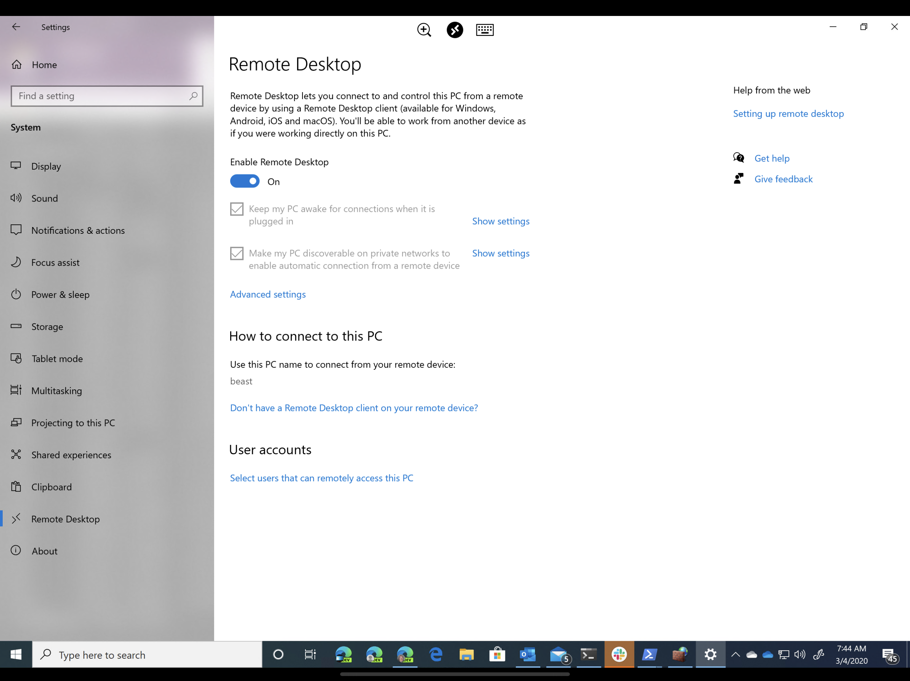
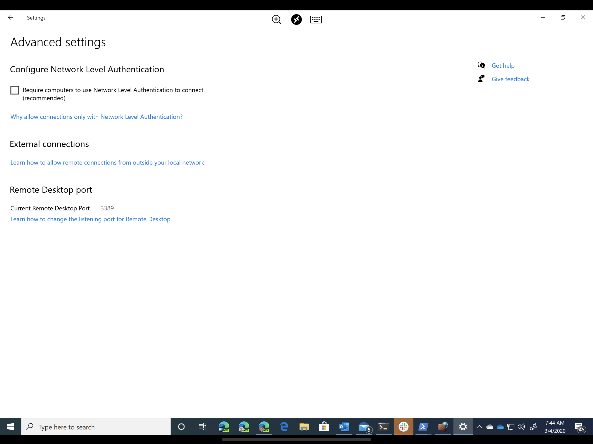
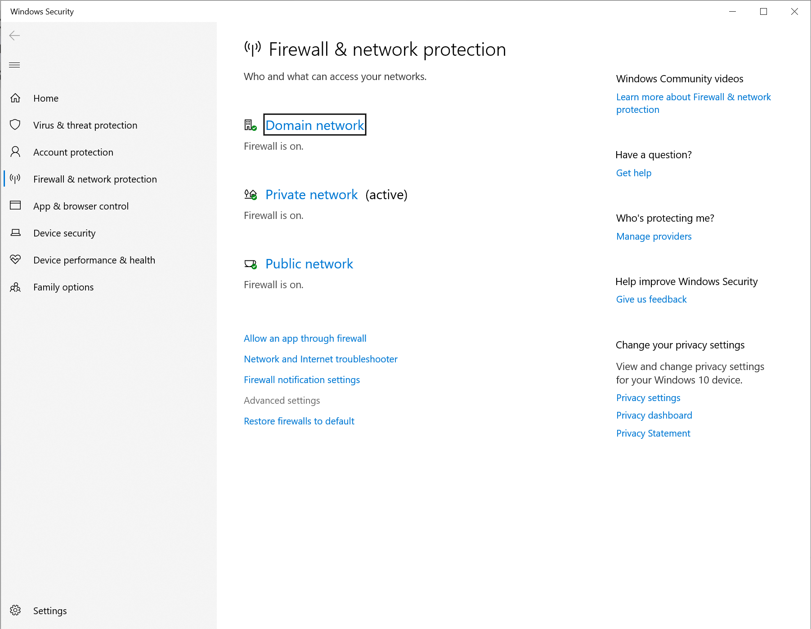
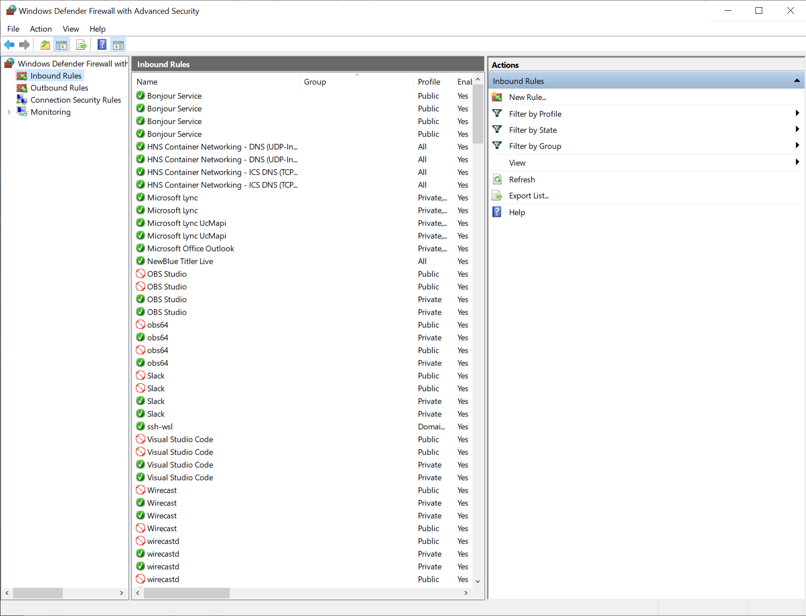
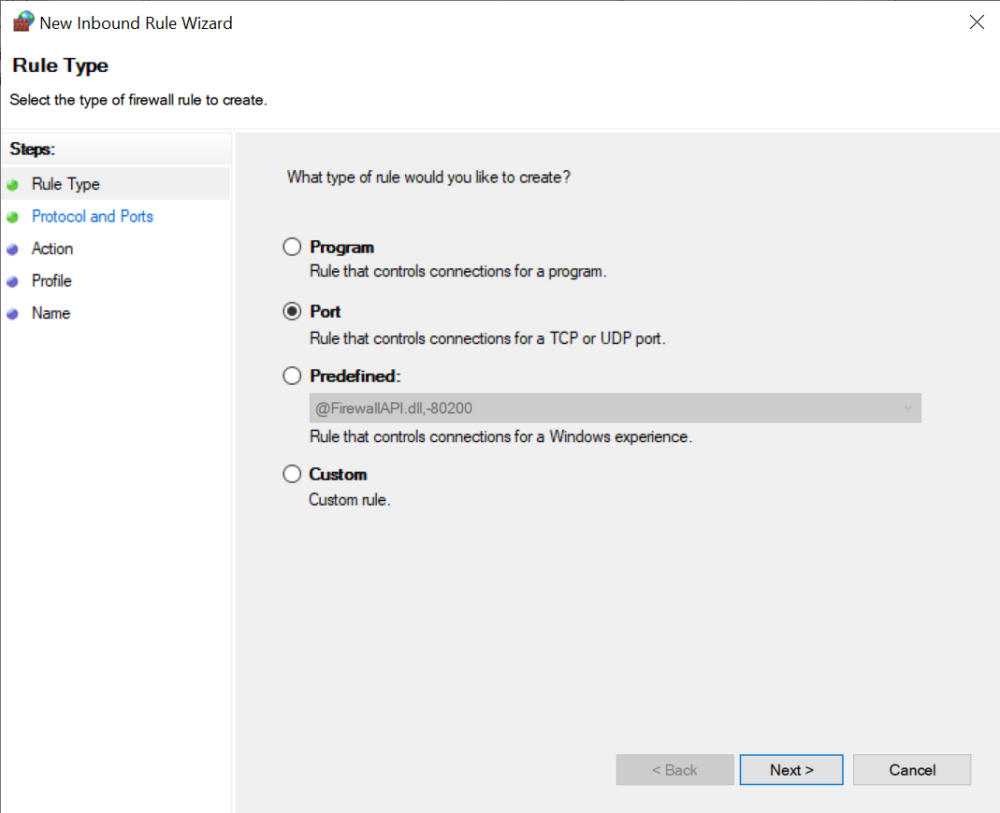
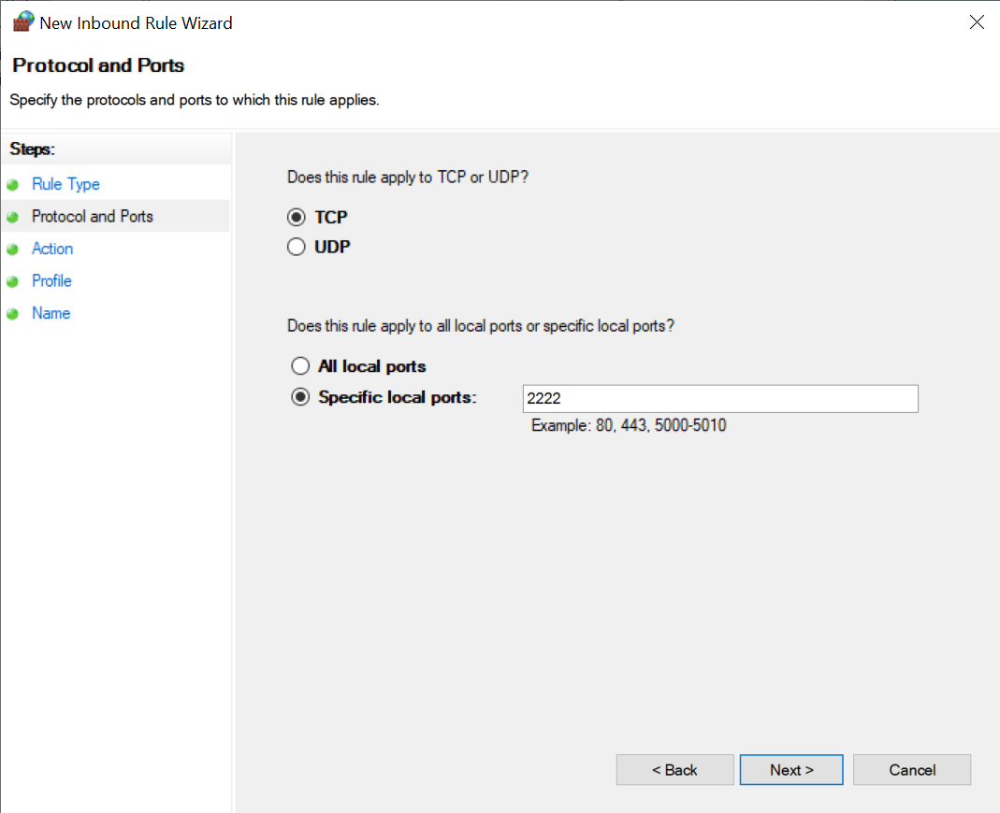
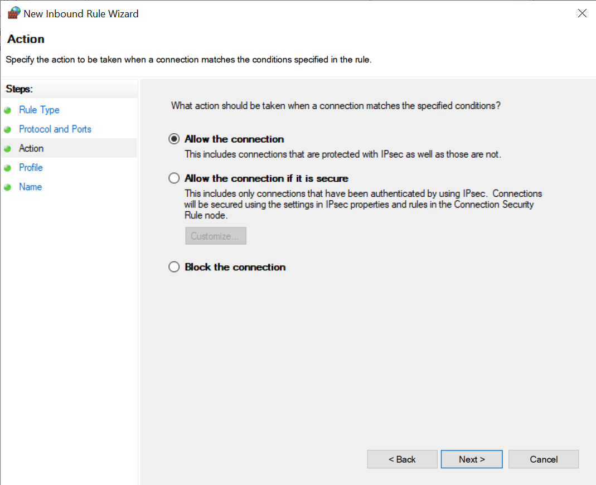

In this article I share my learnings on remotely accessing your Windows 10 computer. My motivation was to determine efficient ways to access both the Windows environment, and the WSL2 development environment from another computer.

<!--more-->

## Remote Access for New Windows Users

Find other articles in this series [with this link](/tags/30daywslchallenge/).

For emphasis in this article, many of the screenshots are taken from my iPad Pro accessing my desktop computer running Windows 10 and WSL2.

### Windows

Accessing a Windows computer remotely is extremely simple and performant compared to options for macOS and Linux. Windows users have long enjoyed the [Remote Desktop Protocol](https://docs.microsoft.com/en-us/windows/win32/termserv/remote-desktop-protocol). An over-simplified description of the RDP protocol would state that it encodes user interface changes as network packets and sends them to the client. RDP has hooks deep into the operating system, so it's a very efficient protocol. On the same local network, an RDP connection is nearly indistinguishable from a local login. Even over the internet, or a VPN, RDP is extremely usable.

#### Enabling Remote Desktop

To enable RDP, go to `Start > Settings > System > Remote Desktop`, and enable the slider.



If you intend to connect from a client that isn't running Windows (like my iPad, for example) you'll also want to click the `Advanced Settings` link and disable Network Level Authentication. This reduces security slightly, so be sure to research the implications and assess your risk before exposing your computers over untrusted networks. My desktop is only available on my local network, or when I use the VPN I've created on my Unifi Edge Router.



That's all you need to do on the host side. On the client, grab a Remote Desktop Client from whichever App Store or software source you usually use for downloads. On my iPad I searched for "Remote Desktop" in the App Store, and downloaded the official Microsoft remote desktop client.

To connect, find your host's IP address and configure the remote desktop client to connect by IP address.

### WSL2

Here's where the fun starts. I'm quite used to connecting to my development environments via ssh. When I moved to Windows, that seemed like something I'd have to give up because it didn't look possible. Then I stumbled on a [post](https://community.ui.com/questions/UNMS-running-on-Windows-10-Subsystem-Linux-2-WSL2/552f3b66-c1f0-41f1-8aa5-f2e6e0f56a5a) on the Unifi forums that mentioned a Windows command I vaguely remember from 15 years ago. `netsh`

Start by installing the package `openssh-server`. Then edit `/etc/ssh/sshd_config` to change the `Listen` port to something other than 22. I set mine to `2222`.

```
❯ cat /etc/ssh/sshd_config
#       $OpenBSD: sshd_config,v 1.101 2017/03/14 07:19:07 djm Exp $

# ... snipped lines ...
Port 2222

# ... more snipped lines ...
PasswordAuthentication no
```

I also set `PasswordAuthentication` to `no`, which means I'll be using SSH keys to authenticate. Put authorized public keys in `~/.ssh/authorized_keys` in order to use this setting. If you don't allow Password Authentication, you have to have keys setup, so don't enable this without understanding what's going on.

Now, using `netsh` I can port forward connections from Windows to the VM that's running WSL2. To do this you'll need to get the IP address of your WSL2 instance. `ip addr` or `ifconfig` should do the trick. Mine is `172.19.149.102`, so the PowerShell command to forward port 2222 from Windows to my WSL2 instance is this:

```
netsh interface portproxy add v4tov4 listenport=2222 listenaddress=0.0.0.0 connectport=2222 connectaddress=172.19.149.102
```

Finally I had to allow port 2222 through the Windows Firewall. The simplest way to do this is using the advanced firewall configuration.



Then open the Advanced Firewall settings:



Click "Inbound" in the left pane, then "New..." on the right pane. Choose "Port":



Then specify port 2222:



Specify "Allow"



Then uncheck "Public" when it asks which networks to apply these rules to. If you're on a public network, we don't want anybody trying to get ssh access anywhere.

#### Profit

Now from anywhere on your LAN, you can ssh to the IP of your Windows computer on port 2222. I used the Blink app on my iPad Pro and connected with the following command:

```
ssh -p 2222 bjk@192.0.1.100
```

where the `192.0.1.100` is the IP address of my Windows machine.

### Update August 2020

The failing of this method is that your WSL2 instance gets a new IP address each time it restarts. Based on several of the suggestions in [this Github issue](https://github.com/microsoft/WSL/issues/4150) I've created a successful workaround.

Start by using Windows Powershell ISE to create a new script called `WSL.ps1`. I saved mine in the root of my User directory in Windows. `C:\Users\me\WSL.ps1` Add this script as the contents of the file then save it:

```
$remoteport = bash.exe -c "ifconfig eth0 | grep 'inet '"
$found = $remoteport -match '\d{1,3}\.\d{1,3}\.\d{1,3}\.\d{1,3}';

if( $found  ){
  $remoteport = $matches[0];

} else{
  echo "The Script Exited, the ip address of WSL 2 cannot be found";
    exit;

}

#[Ports]

#All the ports you want to forward separated by comma
$ports=@(2222);


#[Static ip]
#You can change the addr to your ip config to listen to a specific address
$addr='0.0.0.0';
$ports_a = $ports -join ",";


#Remove Firewall Exception Rules
iex "Remove-NetFireWallRule -DisplayName 'WSL 2 Firewall Unlock' ";

#adding Exception Rules for inbound and outbound Rules
iex "New-NetFireWallRule -DisplayName 'WSL 2 Firewall Unlock' -Direction Outbound -LocalPort $ports_a -Action Allow -Protocol TCP";
iex "New-NetFireWallRule -DisplayName 'WSL 2 Firewall Unlock' -Direction Inbound -LocalPort $ports_a -Action Allow -Protocol TCP";

for( $i = 0; $i -lt $ports.length; $i++  ){
  $port = $ports[$i];
    iex "netsh interface portproxy delete v4tov4 listenport=$port listenaddress=$addr";
      iex "netsh interface portproxy add v4tov4 listenport=$port listenaddress=$addr connectport=$port connectaddress=$remoteport";

}
```

Next click on the Start menu and type `scheduler`. Open `Task Scheduler`.

In the right side menu bar, select `Create Task`. Give it a name (I chose 'WSL'), then choose the `triggers` tab. Select 'At Log On' for the trigger, and 'for any user'.

Now go to the `Actions` tab and create a new action. Choose `Start a program`, type `powershell.exe` as the program name, then type `-ExecutionPolicy Bypass c:\Users\me\WSL.ps1` in the 'arguments' box. Ensure that the path to the script file is correct based on where you saved the script above.

This powershell command executes `ifconfig` which might not be installed by default. In Ubuntu you can install it with the `net-tools` package. If your scheduled task exits _really quickly_ make sure this package is installed. The task takes a few seconds to run.

I've also added a few lines to the end of my `.bashrc` to ensure `ssh` is running:

```bash
SERVICE='ssh'

if ps ax | grep -v grep | grep $SERVICE > /dev/null
then
    echo "$SERVICE service running."
else
    sudo /etc/init.d/ssh start
fi
```

I'll probably extract that out into a bash function called `ensure` so I can use it for more than this task.

#### Extra Credit

For extra credit you can set up port forwarding on your internet router to forward to this same service. I picked a random high port (like 28945), and set up port forwarding from that port to port 2222 on my Windows machine. Because it's an uncommon port, it won't get the usual SSH bot scanning traffic, and I don't have root login or password authentication enabled in the ssh daemon configuration. So I feel relatively good about the security risk. Be sure to understand your security profile before undertaking something like this.

## References and Further Information

-   [WSL Tips and Tricks](https://wsl.dev)
-   [Awesome WSL](https://github.com/sirredbeard/Awesome-WSL/blob/master/README.md)
-   [Windows Subsystem for Linux Documentation](https://docs.microsoft.com/en-us/windows/wsl/about)
-   [All WSL distributions in the Microsoft Store](https://aka.ms/wslstore)
